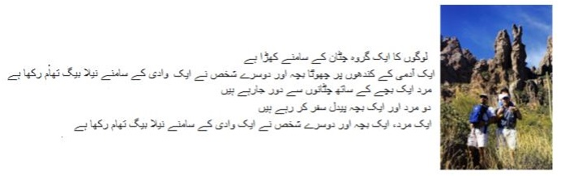
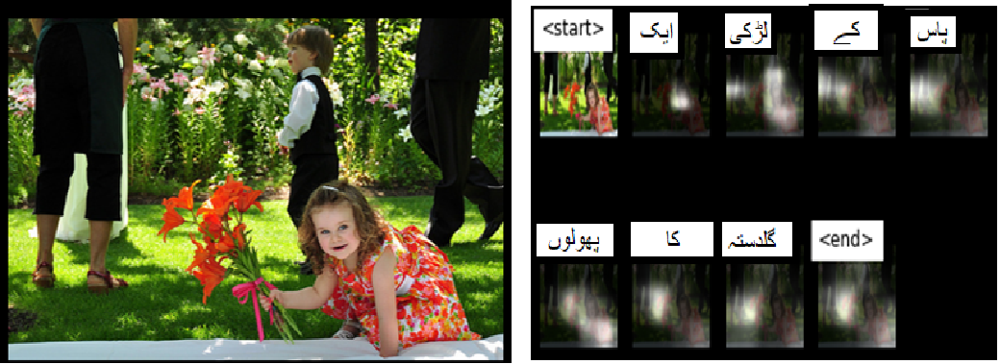
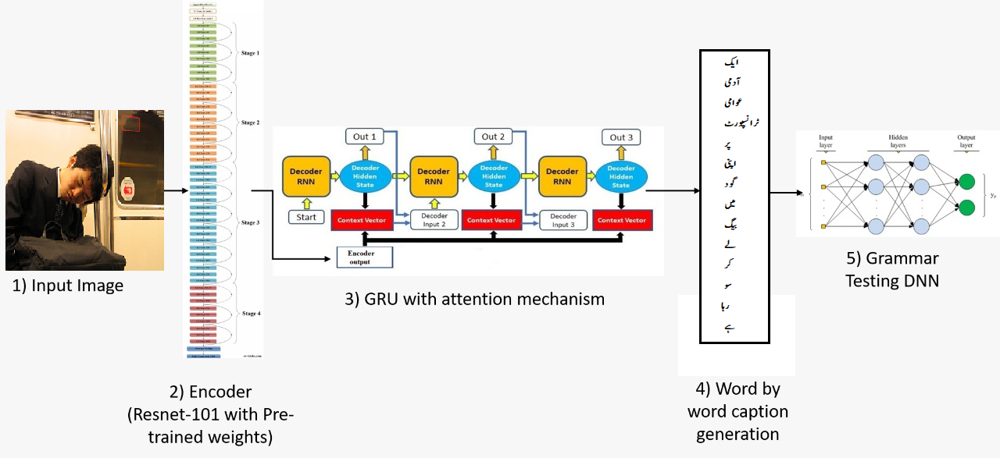
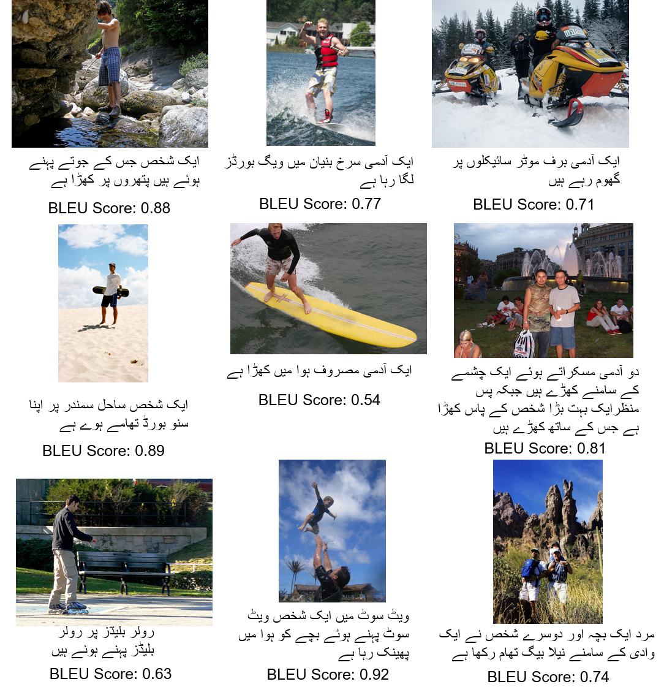
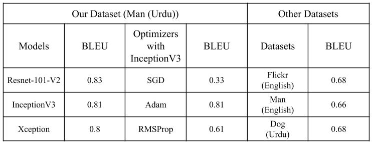

<h1> MSDS19087_Project_DLSpring2020 </h2>
This repository contains code and results for the Course Project by Deep Learning Spring 2020 course offered at Information Technology University, Lahore, Pakistan. This repository is only for learning purposes and is not intended to be used for commercial purposes. 
  

 Course Link: <a href="http://im.itu.edu.pk/deep-learning-spring-2020/">http://im.itu.edu.pk/deep-learning-spring-2020/</a>

<h1> Urdu Caption Generation using Attention Mechanism (G3K) </h1>

<h2> Abstract </h2>

Recent advancements in deep learning has created a lot of opportunities to solve those real world problems which remained unsolved for more than a decade. Automatic caption generation is a major research field, and the research community has done a lot of work on this problem in most common languages like English. Urdu is the national language of Pakistan and also much spoken and understood in the sub-continent region of Pakistan-India, and yet no work has been done for Urdu language caption generation. Our research aims to fill this gap by developing an attention based deep learning model using techniques of sequence modelling specialized for Urdu language. We have prepared a dataset in Urdu language by translating a subset of ”Flickr8k” dataset containing 700 ’man’ images. We evaluate our proposed technique on this dataset and show that it is able to achieve a BLEU score of 0.83 on Urdu language. We improve on the previously proposed techniques by using better CNN architectures and optimization techniques. Furthermore, we also tried adding a grammar loss to the model in order to make the predictions grammatically correct.

<h2> Dataset </h2>

As our main task is caption generation on images in Urdu language. There was no publicaly available dataset for this task. Then we decided to translate a popular image captioning dataset called flickr8k dataset from scratch as available translators were not suffeciently accurate especially on idioms and context understanding. Flickr8k dataset has 8,000 images, and for each image there are 5 captions in english. We selected about 700 images with 3500 captions with similar context to translate into Urdu. The selected captions are related to a "Man" who is doing different activities such as Water-boarding, Snow-boarding and biking.

   
 Original Flickr8k Dataset: <a href="https://www.kaggle.com/shadabhussain/flickr8k">Download Here</a>
 Translated Captions in Urdu: <a href="https://drive.google.com/file/d/1XtEPGKVOQKzWRdW0_hX_TiYIpLiG3XY9/view?usp=sharing">Download Here</a>

<h2> Model </h2>

Most of our caption generation model is inspired by "Show, Attend and Tell: Neural Image Caption Generation with Visual Attention"<a href="https://www.google.com/url?sa=t&rct=j&q=&esrc=s&source=web&cd=&cad=rja&uact=8&ved=2ahUKEwj06sSIsLnqAhUBdxoKHXXWDVIQFjAAegQIAxAB&url=https%3A%2F%2Farxiv.org%2Fabs%2F1502.03044&usg=AOvVaw2fkPnA9NgkHSOMoo1IpKeA">[1]</a>
Model consist of Encoder and a Decoder architecture. Encoder part uses a CNN (We did experiments of ResNet-101-V2, InceptionV3 and Xception) to extract features from images while Decoder uses attention mechanism and GRU. We used Bahdanau Attention in our model. The main purpose of the attention mechanism is to focus on relevant part of image. GRU is just like LSTM with less parameters and gates that makes it faster and less computationally expansive. GRU is used to generate next word of caption in current time step. The generated word is based on features of image, previous hidden state of GRU, current input to decoder and context vector generated by attention mechanism. In the end model check if the grammar of generated caption is good or bad.

<h4>Example of working of Attention Mechanism</h4> 
<h4>Model Diagram</h4> 
<h2>Generated Captions</h2> 
<h2>Results</h2>

We used BLEU score as evaluation matrix to evaluate performance of model.
  
<h4>Contribution</h4>
Members of our group are My self <b>Hafiz Muhammad Abdullah Zia</b>, Inam Ilahi, Armughan Ahmed, Rauf Tabassum, and Ahtazaz Ahsan

